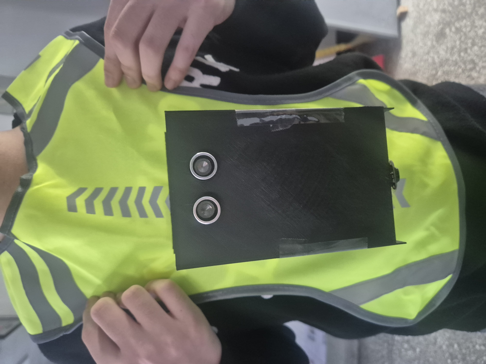

# 🕶️ Eyevision: 시각장애인용 듀얼 센서 보행 보조 기기

[📂 전체 소스 코드 다운로드](./Dual_Sensor_Assist_EyeVision.ino)

 

 

## 🏆 수상 내역
**제 1회 U7 메이커스 경진대회 대상 (안양시장상) 수상**

 

## 1. 프로젝트 개요

### 💡 개발 배경
기존의 시각장애인용 지팡이는 바닥 장애물은 잘 감지하지만, **상단(머리 충돌)**이나 **하단(계단/낙상)** 같은 사각지대 사고는 막기 어렵다는 점에 주목했습니다.
저희 팀은 **초음파 센서(상단)**와 **ToF 센서(하단)**를 결합하여 위험을 감지하여 버저를 울리는  웨어러블 디바이스 **'Eye-Vision'**을 개발했습니다.

### 📝 프로젝트 상세
* **프로젝트명:** Eye-Vision (아이비전)
* **개발 기간:** 2025.09 ~ 2026.01 (5개월)
* **팀 구성:** 3인 
* **나의 역할 (팀장):**
    * **시스템 설계:** 하드웨어 회로 구성 및 소프트웨어 통합 시스템 설계
    * **알고리즘 개발:** 노이즈 제거 필터 및 낙상 감지 로직 구현
    * **문제 해결:** 센서 오작동 개선 및 전력 안정화 설계

 

## 2. 시스템 사양

### 📐 시스템 구성도
| 회로도 | 로직 순서도 |
| :---: | :---: |
|  |  |

### 🛠 하드웨어 구성
* **MCU:** Arduino Nano (ATmega328P)
* **상단 센서 (충돌 방지):** 초음파 센서 (HC-SR04) - 넓은 범위 감지
* **하단 센서 (낙상 방지):** ToF 센서 (VL53L1X) - 정밀 거리 측정
* **알림 장치:** 능동 부저 (상황별 다른 경고음 발생)

 

## 3. 핵심 알고리즘
> *단순한 센서 값 측정을 넘어, 데이터 신뢰성을 높이기 위한 신호 처리 기술을 적용했습니다.*

### 💻 1. 실시간 병렬 처리 (Non-blocking)
`delay()` 함수를 쓰면 센서를 읽는 동안 시스템이 멈추는 문제가 있습니다. 이를 해결하기 위해 **타이머 기반의 스케줄러**를 구현하여, 센서 측정과 경고음 출력이 멈춤 없이 동시에 작동하도록 했습니다.

### 📉 2. 데이터 필터링 (EMA)
센서 값이 순간적으로 튀는 노이즈를 잡기 위해 **지수 이동 평균(EMA) 필터**를 사용했습니다. 단순히 평균을 내는 것이 아니라 **최신 데이터에 더 가중치**를 두어, 반응 속도는 빠르게 유지하면서 노이즈만 부드럽게 제거했습니다.

 

## 4. 핵심 문제 해결 과정 (Troubleshooting)

### ⚠️ 문제 1: 센서 데이터가 불규칙하게 튀는 현상
**[상황]**
저가형 센서 특성상 전압이 조금만 불안정해도 장애물이 없는데 값이 0으로 측정되는 등 오작동이 심했습니다.

**[해결]**
하드웨어와 소프트웨어 양쪽에서 이중으로 노이즈를 잡았습니다.
1.  **하드웨어:** 전원 선에 **커패시터(Capacitor)**를 병렬로 달아 전압이 흔들리는 것을 물리적으로 막았습니다.
2.  **소프트웨어:** 위에서 언급한 **EMA 필터**를 적용해 소프트웨어적으로 한 번 더 값을 다듬어 안정성을 확보했습니다.

### ⚠️ 문제 2: 계단이나 턱을 제대로 감지하지 못함 (핵심)
**[상황]**
처음에는 "바닥과의 거리가 50cm 이상이면 위험"이라고 단순하게 설정했습니다. 하지만 계단, 턱, 경사로마다 높이가 다 달라서 **어떤 곳에서는 위험한데도 경보가 울리지 않는 문제**가 발생했습니다.

**[해결: '거리'가 아니라 '속도'를 보자]**
지형의 높이는 제각각이지만, **"낭떠러지나 계단을 만나는 순간 바닥과의 거리는 순식간에 멀어진다"**는 점에 착안했습니다.
* **로직 변경:** 단순히 현재 거리값을 보는 게 아니라, **"거리가 얼마나 빠르게 변하는가(속도)"**를 계산하도록 코드를 수정했습니다.
* **구현:** 보행 중 바닥 거리가 **급격하게 멀어지는 순간(속도가 급변할 때)**만을 정확히 포착하여 낙상 경보를 울리게 만들었습니다.

## 5. 프로젝트 결과 및 성과 (Results)

### 🎥 실제 작동 시연 (Demo Videos)
> *각 이미지를 클릭하면 해당 기능의 유튜브 시연 영상으로 이동합니다.*
> *(개인정보 보호를 위해 신원 식별 정보는 블러 처리되었습니다.)*

| **1. 하단 낙상 감지 (ToF Sensor)** | **2. 상단 충돌 방지 (Ultrasonic)** |
| :---: | :---: |
| | |
|  |  |
| **계단/난간 진입 시 즉시 경고** | **전방 장애물(벽/사람) 감지 알림** |

 

### 📊 영상 내 핵심 포인트 (Key Features)

**1. 하단 영상 (ToF): 낙상 방지**
* **상황:** 계단이나 턱으로 인해 바닥 깊이가 급격히 변하는 구간 진입.
* **동작:** 거리 변화율(속도)을 미분 계산하여, 위험 감지 시 **0.1초 내** 경고음 송출.

**2. 상단 영상 (Ultrasonic): 충돌 방지**
* **상황:** 보행자 머리나 가슴 높이의 전방 장애물 출현.
* **동작:** 초음파 센서가 1.5m ~ 2m 거리에서 장애물을 인식하여 사전 충돌 방지.

 

### 🏆 최종 성과
**2025 U7 메이커스 경진대회 대상 (안양시장상) 수상**
