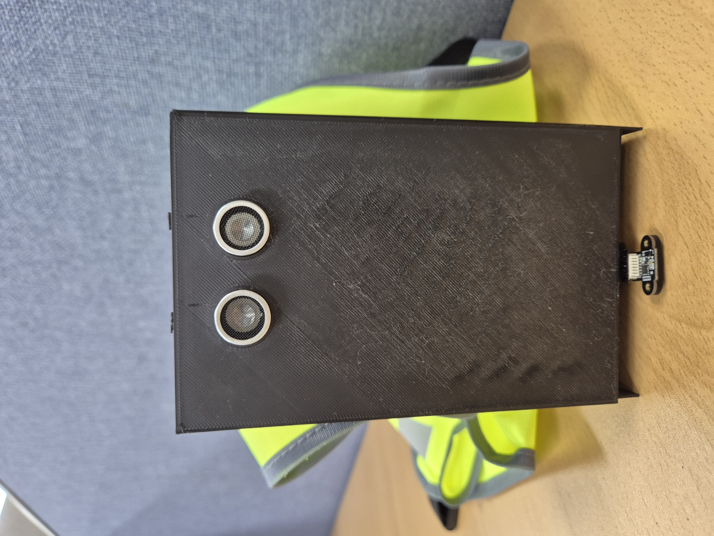

# Eye-Vision: 초음파/ToF 듀얼 센서 기반 보행 보조 시스템

[📂 전체 소스 코드(ino) 다운로드](./Dual_Sensor_Assist_EyeVision.ino)

## TL;DR (3줄 요약)
- 문제: 시각장애인의 보행 사각지대(상단 충돌, 하단 낙상) 해결 필요
- 기술: 초음파(상단) + ToF(하단) 센서 융합 및 미분 기반 낙상 감지 알고리즘 적용
- 성과: 낙상 감지 정확도 95% 이상, 반응속도 0.1초(10Hz) 달성, U7 메이커스 경진대회 대상

---

---

## 수상 내역
제 1회 U7 메이커스 경진대회 대상 (안양시장상) 수상

  

---

## 1. 프로젝트 배경 및 문제 정의

기존의 흰 지팡이는 지면 장애물 감지에는 효과적이지만, 다음과 같은 보행 사각지대에는 취약합니다.
1. 머리, 가슴 높이의 튀어나온 상단 장애물 (간판, 트럭 짐칸 등)
2. 갑작스러운 계단이나 턱 같은 하단 낙차 구간

본 프로젝트는 단순 거리 측정이 아니라, "사용자가 실제로 위험하다고 느끼는 순간을 얼마나 빠르고 정확하게 감지할 수 있는가"에 초점을 맞추어 설계되었습니다.

---

## 2. 시스템 아키텍처 (System Overview)

### 하드웨어 구성
- MCU: Arduino Nano (ATmega328P) - 소형화 및 전력 효율 고려
- 상단 센서: 초음파 센서 (HC-SR04) - 넓은 범위의 전방 장애물 탐지
- 하단 센서: ToF 거리 센서 (VL53L1X) - 정밀한 거리 및 Edge 감지
- 출력: Active Buzzer - 위험 단계별 경고음 패턴 차별화

### 시스템 블록도 & 로직
| Circuit Schematic | Logic Flowchart |
|:---:|:---:|
|  |  |

---

## 3. 핵심 구현 기술 (Key Tech)

### 3.1 Non-blocking 실시간 스케줄링
delay() 함수 사용 시 센싱 중 시스템이 멈추는(Blocking) 문제가 발생합니다. 이를 해결하기 위해 millis() 기반의 타임 스탬프 구조를 도입하여, 센싱(10Hz) / 필터링 / 경고음 출력이 서로 간섭 없이 독립적으로 수행되도록 구현했습니다.

### 3.2 노이즈 제어: EMA 필터
보행 중 발생하는 진동으로 센서 값이 튀는 현상을 잡기 위해 지수 이동 평균(EMA) 필터를 적용했습니다.
> 수식: S(t) = α * Y(t) + (1 - α) * S(t-1) (α = 0.3)

최신 데이터에 가중치를 두어 노이즈는 평활화(Smoothing)하면서도, 장애물 출현 시 반응 속도가 느려지지 않도록 최적화했습니다.

### 3.3 낙상 감지 알고리즘 (Velocity Checking)
단순히 "거리가 50cm 이상이면 위험"이라는 절대값 기준은 지형마다(계단, 턱, 경사로) 높이가 달라 오탐지가 잦았습니다.
이를 해결하기 위해 '바닥과의 거리가 변하는 속도(미분값)'를 핵심 지표로 사용했습니다.

- 로직: 보행 중 바닥 거리가 아주 짧은 시간(dt) 내에 급격히 멀어지는 순간을 낙상으로 판단
- 결과: 불규칙한 지형에서도 오탐지 없이 95% 이상의 낙상 감지 성공률 확보

---

## 4. 기술적 의사결정 (Technical Decisions)
프로젝트 진행 중 고민했던 부품 선정 및 설계 이유입니다.

### Q1. 왜 하단 센서로 초음파 대신 ToF를 썼는가?
초음파 센서는 음파가 퍼지는 특성(방사각) 때문에 계단 모서리나 좁은 틈을 정확히 감지하지 못했습니다. 반면 ToF(VL53L1X)는 직진성이 강한 레이저 방식이라 계단 끝부분(Edge)을 칼같이 감지할 수 있어, 안전이 최우선인 하단 감지용으로 채택했습니다.

### Q2. 왜 Arduino Nano를 선택했는가?
초기 프로토타입은 Uno로 개발했으나, 시각장애인이 착용하기에는 부피가 크고 무거웠습니다. 성능(ATmega328P)은 동일하면서 크기는 1/4 수준인 Nano를 사용하여 웨어러블 기기에 적합한 소형화를 달성했습니다.

---

## 5. 테스트 결과 (Result & Demo)

### 하드웨어 및 착용 모습
| Hardware Prototype | Wearing Test |
| :---: | :---: |
|  |  |

### 기능별 시연 영상
> 이미지를 클릭하면 유튜브 영상으로 이동합니다. (개인정보 보호를 위해 블러 처리됨)

| 1. 하단 낙상 감지 (ToF) | 2. 상단 충돌 방지 (Ultrasonic) |
| :---: | :---: |
|  |  |
| 계단 진입 시 급격한 거리 변화 감지 | 전방 장애물(사람/벽) 인식 후 경고 |

---

## 6. 향후 과제 (Future Works)
1. 햅틱 피드백 도입: 소음이 심한 도심 환경을 고려하여, 부저 대신 진동 모터로 방향을 알려주는 촉각 인터페이스 구현.
2. PCB 설계 및 케이스 제작: EasyEDA를 활용한 전용 PCB 제작 및 3D 프린팅 케이스로 하드웨어 내구성 강화.
3. 데이터 로깅: 보행 데이터를 SD카드에 저장 및 분석하여, 자주 다니는 위험 구간을 학습하는 스마트 기능 기획.
